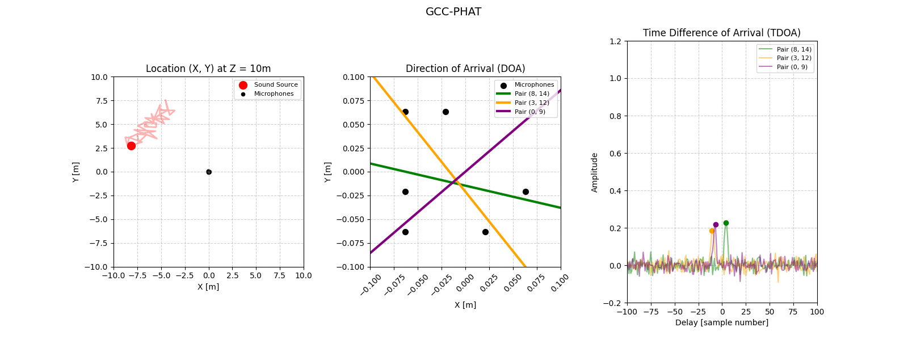

# PHAT Sound Source Localization

Real-time sound source tracking and trajectory estimation system using a microphone array and phase-transform-based acoustic localization methods.

---

## GCC-PHAT (Generalized Cross-Correlation with Phase Transform)

### Processing Pipeline
* **TDOA:** Measuring the sound delay between microphone pairs using phase-based methods.
* **DOA:** Finding the direction (angle) of the incoming sound.
* **Location:** Calculating the target's $(X, Y)$ position at a given flight altitude.